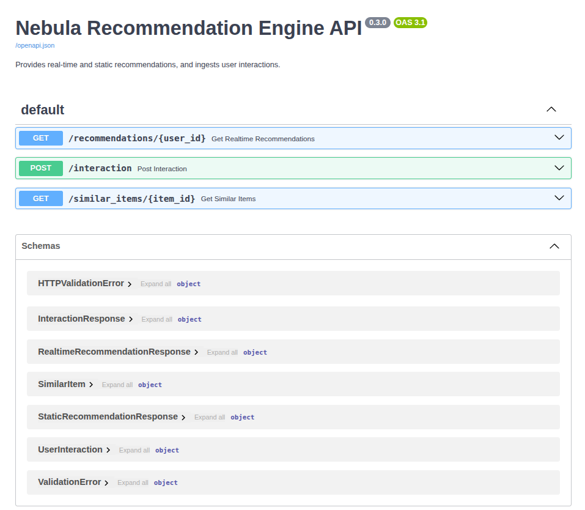

# ✨ Project Nebula: A Real-Time Recommendation Engine


![Milvus](https://img.shields.io/badge/Milvus-2.4-00ADEF?style=for-the-badge&logo=data:image/svg+xml;base64,PHN2ZyB2aWV3Qm94PSIwIDAgMjQgMjQiIHhtbG5zPSJodHRwOi8vd3d3LnczLm9yZy8yMDAwL3N2ZyI+PHBhdGggZD0iTTEyIDBDNS4zNzMgMCAwIDUuMzczIDAgMTJzNS4zNzMgMTIgMTIgMTIgMTItNS4zNzMgMTItMTJTMTguNjI3IDAgMTIgMHptLjI0IDEuNDQ4YzEuMjA5IDAgMi4zNDQuMzc2IDMuMjgzIDEuMDEyYTQuNzY3IDQuNzY3IDAgMCAxIDEuMzg1IDEuNTQ1Yy4zNzUuNjE4LjU4IDEuMzE1LjU4IDIuMDI3djEuMjg0aC0yLjM0di0xLjI4NGMwLS41MS0uMTM0LS45NDItLjQwMy0xLjI5NmEtMS45MyAxLjkzIDAgMCAwLTEuNTQ1LS42NTdjLS44OTMgMC0xLjU4LjI5LTEuOTQzLjc3YS0yLjMzIDIuMzMgMCAwIDAtLjQ5IDEuNTA2djYuNDQ1YzAgLjY1OC4xNjcgMS4xODQuNDkgMS41MDZhMi4wMyAyLjAzIDAgMCAwIDEuOTQzLjc3YzEuMDAzIDAgMS42NDktLjM0NSAxLjkxMy0xLjA0N3YtMy4wNzRoMi4zNHYzLjA3NGMwIC43MTItLjIwNSAxLjQxLS41OCAyLjAyN2ExMi4xMyAxMi4xMyAwIDAgMS0xLjM4NSAxLjU0NWMtLjkzOS42MzYtMi4wNzQgMS4wMTItMy4yODMgMS4wMTItMS42MiAwLTMuMDM1LS40MzYtNC4xNTMtMS4zMDZhNi4xMzcgNi4xMzcgMCAwIDEtMS41NzQtMi40NDJjLS4zMTQtMS4wMy0uNDk5LTIuMTUtLjQ5OS0zLjM1N1Y3LjcyM2MwLTEuMjA3LjE4NS0yLjMyNy40OTktMy4zNTdhNS41MTUgNS41MTUgMCAwIDEgMS41NzQtMi40NDJjMS4xMTgtLjg3IDMuNTMzLTEuMzA2IDQuMTUzLTEuMzA2ek00LjQ4NSA1LjQxNmgzLjM5OXYxMy4xNjdINC40ODVWNS40MTZ6IiBmaWxsPSIjZmZmIi8+PC9zdmc+)


This repository contains the complete source code for 'Nebula', an end-to-end recommendation engine that updates a user's recommendations in real-time as they interact with a product catalog.

The system is designed with a modern, scalable architecture representative of what top tech companies are building today. It reacts to user actions within seconds, a vast improvement over traditional batch-based systems.

## 🚀 Live Demo


The demo above shows the full end-to-end system in action:

1.  A user's recommendations are initially empty.
2.  An interaction event is simulated for the user by clicking "Send Interaction".
3.  The Bytewax processor consumes this event, updates the user's "taste profile" vector, queries Milvus for new recommendations, and caches the result in Redis.
4.  When the UI is refreshed, the new, personalized recommendations instantly appear.
5.  A second, different interaction is sent for the same user.
6.  The UI is refreshed again, and the recommendation list changes, reflecting the user's evolving taste profile.

## ✨ Key Features

- **True Real-Time ML**: Reacts to user actions within seconds, not hours or days.
- **Python-Native Stateful Stream Processing**: Uses **Bytewax**, a modern, lightweight stream processing framework to manage and update a "taste profile" vector for each user in real-time.
- **Vector Search at Scale**: Leverages **Milvus**, an open-source vector database, to store nearly 500,000 product embeddings and perform efficient, low-latency similarity searches.
- **Decoupled & Scalable Architecture**: A robust event-driven architecture using **Redpanda** (a Kafka-compatible message broker) to decouple the ingestion API from the stream processor.
- **High-Performance Serving**: Serves final recommendations from a **Redis** cache, ensuring a sub-millisecond response time for the end user.
- **Fully Containerized**: The entire infrastructure is managed with **Docker Compose**, allowing for one-command setup and reproducible deployments.

## 🏗️ System Architecture

The system is composed of three distinct pipelines: an **Offline Pipeline** for initial data preparation, an **Online (Streaming) Pipeline** for live processing, and a **Serving Layer** for user-facing requests.


### 📷 System Screenshots

#### Redpanda Console Web UI

The console shows the `user_interactions` topic successfully receiving events from the API.
<br/>


---

#### FastAPI Interactive Documentation

The auto-generated Swagger UI for the API, showing all available endpoints for ingestion and serving.
<br/>


---

#### Streamlit Interactive Dashboard

The final user interface, demonstrating both the real-time recommendation updates and the static, content-based similarity search.
<br/>

<br/>


## ⚙️ Technology Stack

| Category              | Technology                                              | Purpose                                                                  |
| --------------------- | ------------------------------------------------------- | ------------------------------------------------------------------------ |
| **Stream Processing** | **Bytewax**                                             | Python-native stateful computation and real-time ML updates.             |
| **Message Broker**    | **Redpanda**                                            | High-performance, Kafka-compatible message bus for events.               |
| **Vector Database**   | **Milvus**                                              | Storing and indexing item embeddings for fast similarity search.         |
| **Caching & Serving** | **Redis**                                               | Storing final recommendation lists for low-latency retrieval.            |
| **APIs & Backend**    | **Python, FastAPI**                                     | Building the ingestion and serving APIs.                                 |
| **ML & Data Prep**    | **Hugging Face (SentenceTransformers), PyTorch, Numpy** | Generating item embeddings and performing vector arithmetic.             |
| **Orchestration**     | **Docker & Docker Compose**                             | Containerizing and managing all services for a reproducible environment. |
| **Real-Time UI**      | **Streamlit**                                           | Simple, interactive dashboard to demonstrate the system.                 |

## 🚀 Getting Started

Follow these instructions to set up and run the entire project on your local machine.

### Prerequisites

- Docker and Docker Compose
- Python 3.10+ and `pip`
- A CUDA-enabled GPU is recommended for faster embedding generation but is not required.

### 1. Clone the Repository

```bash
git clone https://github.com/Mordris/real-time-recommendation-engine.git
cd real-time-recommendation-engine
```

### 2. Set Up Python Environment

```bash
python3 -m venv venv
source venv/bin/activate
pip install -r requirements.txt
```

### 3. Download the Dataset

The project uses the Stanford SNAP Amazon Products dataset for Electronics.

- **Download the file:** [meta_Electronics.json.gz](https://snap.stanford.edu/data/amazon/productGraph/categoryFiles/meta_Electronics.json.gz)
- **Move it** into the `data/` directory within the project folder. The final path should be `data/meta_Electronics.json.gz`.

### 4. Run the Backend Infrastructure

This command starts Milvus, Redpanda, Redis, and the Redpanda Console in the background.

```bash
docker compose up -d
```

Wait about 60 seconds for all services to become healthy. You can check their status with `docker compose ps`.

### 5. Run the Offline Ingestion Script

This script will read the dataset, generate embeddings for all ~491,000 products, and load them into Milvus.

**This is a one-time setup step and will take 10-15 minutes, depending on your hardware.**

```bash
python batch_embedder.py
```

### 6. Run the Full System

You need to run three components in three separate terminals.

- **Terminal 1: Start the API Server**

  ```bash
  uvicorn api.main:app
  ```

- **Terminal 2: Start the Bytewax Stream Processor**

  ```bash
  python -m bytewax.run realtime_processor.processor:flow
  ```

- **Terminal 3: Start the Streamlit UI**
  ```bash
  streamlit run ui/app.py
  ```

A browser tab should open automatically to `http://localhost:8501`. You can now interact with the system!

## 📂 Project Structure

```
.
├── api/
│   └── main.py              # FastAPI application (ingestion and serving)
├── data/
│   └── meta_Electronics.json.gz # The dataset file (must be downloaded)
├── docs/
│   ├── diagrams/
│   │   └── nebula_system_diagram.png # The main architecture diagram
│   └── screenshots/         # Screenshots for the README
├── realtime_processor/
│   └── processor.py         # The Bytewax dataflow script
├── ui/
│   └── app.py               # The Streamlit dashboard application
├── batch_embedder.py        # Offline script to populate Milvus
├── config.py                # Central configuration for all components
├── docker-compose.yml       # Defines all backend services
├── requirements.txt         # Python dependencies
└── README.md                # This file
```
